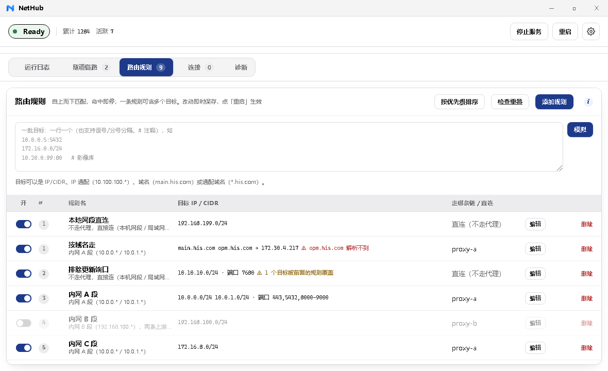

# NetHub

**给指定网段装一条隐形代理**：目标落在你配的网段里的 TCP 连接会被内核层（WinDivert）接管，
经你自己的 SOCKS5 / HTTP 上游转发出去。替代「Proxifier + gost 脚本」。

## 功能

- **应用零改动** —— 浏览器、数据库客户端、任何按 hosts 解析的程序都不用配代理
- **规则对齐 Proxifier** —— 一条规则 = 名字 + 一组目标 + 走哪个链；自上而下匹配、命中即止
- **自带代理客户端** —— `socks5` / `socks5+tls` / `socks4` / `http` / `https`，不需要装 gost；
  同时gost 的 `.bat` 可以在界面里直接导入（只取其中的上游地址）
- **界面**（Wails + WebView2）—— 实时日志、链路自检、与 Clash 共存检测、深/浅主题、托盘常驻
- **不抢设置** —— 不改系统代理、不动路由表，和 Clash / v2rayN 这类工具共存

## 安装

到 [Releases](https://github.com/Lithivm/NetHub/releases) 下载 `NetHub.zip`，解压到任意目录：

1. **先让安全软件放行驱动** —— 火绒 / 360 / 腾讯管家默认会拦 `WinDivert64.sys`：
   信任 `nethub.exe` 和 `WinDivert64.sys`，然后**重启安全软件**
   （白名单是启动时读进内存的，不重启不生效；漏了这步会一直报 **1450**）
2. 双击 `nethub.exe`（会请求一次管理员权限）
3. **在界面里配置**：到「隧道链路」页填上你的上游地址 → 到「路由规则」页加一条规则（网段 → 走哪条链）
   → 回顶部点「启动服务」。配置也可以直接改程序目录里的 `config.yaml`（模板见 `config.yaml.example`），两者等价

需要 Windows 10 / 11 x64 + 管理员权限。

---

详细用法（配置项、常见问题、与 Clash 共存）见 [`docs/使用说明.md`](docs/使用说明.md)；
改代码看 [`docs/DEVELOPMENT.md`](docs/DEVELOPMENT.md)；界面设计规范见 [`DESIGN.md`](DESIGN.md)。
MIT 许可，第三方组件（WinDivert 等）见 [`LICENSE`](LICENSE)。
