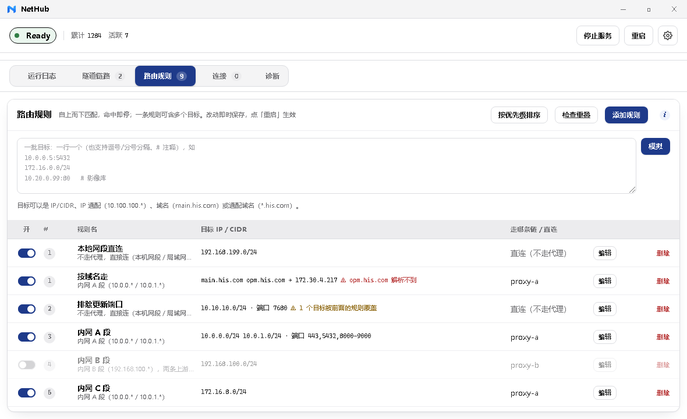

# NetHub

**给指定网段装一条隐形代理**：目标落在你配的网段里的 TCP 连接会被内核层（WinDivert）接管，
经你自己的 SOCKS5 / HTTP 上游转发出去。替代「Proxifier + gost 脚本」。



## 功能

- **应用零改动** —— 浏览器、数据库客户端、任何按 hosts 解析的程序都不用配代理
- **规则对齐 Proxifier** —— 一条规则 = 名字 + 一组目标 +（可选）一组端口 + 走哪个链；自上而下匹配、命中即止；
  动作还可以是「**直连**」（不走代理）或「**阻断**」，用来放行本机网段 / 局域网邻居（打印机、共享盘）或拉黑某些地址
- **一条链可填多个上游** —— 故障转移 / 轮询 / 随机 / 粘性（同一台客户端固定走同一条），自带健康探测，坏了自动换、好了自动回
- **快** —— 预热连接池（把 TCP+TLS+握手提前做好，业务连接来了只发一条 CONNECT）、TLS 会话复用、
  「第一条超过 150ms 未连上就并发试其他上游」（实测某条链要 620ms、另一条只要 75ms，竞速直接把业务拉到快链路）
- **看得见** —— 「连接」页实时显示动作/链/时长/收发字节；业务目标定时巡检（默认关，设置里一键开）；疑似环路检测（被别的代理绕回来时告警）
- **运维友好** —— 配置自动备份（留 3 份）可回滚、配置体检、规则重叠检查、一键诊断包（凭据已抹掉，可直接发给别人）、
  配置一键导出/导入（一个文件就够）、按需抓包（导出 pcap，Wireshark 直接打开）
- **自带代理客户端** —— `socks5` / `socks5+tls` / `socks4` / `http` / `https`（加 `?cert=&key=` 可带上客户端证书，供要求双向认证的上游用）；不需要装 gost；
  旧 gost 的 `.bat` 可以在界面里直接导入（只取其中的上游地址）
- **口令是明文**（和 gost 脚本一样）—— `config.yaml` 里直接写账号口令，不加密；
  发配置给别人看用「导出配置（抹掉口令）」。**不要把 config.yaml 提交进 git 或发到群里**
- **界面**（Wails + WebView2）—— 实时日志、链路自检、与 Clash 共存检测、深/浅主题、托盘常驻
- **不抢设置** —— 不改系统代理、不动路由表，和 Clash / v2rayN 这类工具共存
- **改完不用重启** —— 规则 / 链路 / 上游/ 拨号参数保存即生效（不断已有连接）；
  CLI 用 `nethub.exe -apply` 改完能等到“运行实例真的吃进去了”才返回
- **QUIC 不再漏出去** —— 本该走链的目标上的 HTTP/3（UDP 443）会被拦下并记一行日志，
  而不是默默地直连出去；浏览器随即回落 TCP，那条路仍由我们接管

## 安装

到 [Releases](https://github.com/Lithivm/NetHub/releases) 下载 `NetHub.zip`，解压到任意目录：

1. **先让安全软件放行驱动** —— 火绒 / 360 / 腾讯管家默认会拦 `WinDivert64.sys`，两个文件要分别放行：
   - `nethub.exe` → 杀软的**信任区**（免得主程序被当木马删掉）
   - `WinDivert64.sys` → **火绒 6.0：系统防护 → 漏洞驱动拦截 → 例外驱动**；
     360 / 腾讯管家：驱动（内核）防护白名单
   - **只加信任区不够**：火绒把 WinDivert 当“漏洞驱动”在内核层直接拒加载，
     这时程序报的是 **1450「系统资源不足，无法完成请求的服务」** —— 字面像内存不够，其实不是。
   - 加完**重启安全软件**：例外/白名单是它启动时读进内存的，不重启不生效。

   漏了这步的表现：开机自启时驱动加载失败（没人盯着界面，最容易被拦），
   日志里反复出现 `WinDivert 打开失败(第 N/6 次)`，程序起不来。
2. 双击 `nethub.exe`（会请求一次管理员权限）
3. **在界面里配置**：到「隧道链路」页填上你的上游地址 → 到「路由规则」页加一条规则（网段 → 走哪条链）
   → 回顶部点「启动服务」。配置也可以直接改程序目录里的 `config.yaml`（模板见 `config.yaml.example`），两者等价
   （别忘了给本机网段加一条「直连」规则，规则页有「填本机网段」按钮）

需要 Windows 10 / 11 x64 + 管理员权限。

## 命令行 / 无界面

同一个 `nethub.exe` 也能完全不靠界面用（脚本、自动化、远程运维、让 agent 配网络）：

```bash
nethub.exe -check                # 只校验配置文件，逐条列出错误（不启动、不改任何东西，不需管理员）
nethub.exe -status               # 打印机器可读的 JSON 现状：版本/服务状态/链路/规则/开关/运行实例（含它在用哪份配置）
nethub.exe -apply <新配置.yaml>   # 校验 → 落盘 → 让正在运行的实例热生效（不重启、不断已有连接）
nethub.exe -headless             # 无界面只跑引擎（自动化用）
nethub.exe -service-install      # 装成 Windows 服务（开机即启、无人登录也跑）
nethub.exe -service-uninstall    # 卸载服务
nethub.exe -service-state        # 打印服务状态
nethub.exe -quit                 # 让正在运行的实例优雅退出
nethub.exe -clash-check          # 只检测系统代理会不会把内网送进代理
nethub.exe -test-upstream        # 直接实测上游链路（不经 gost）
nethub.exe -import-bats <目录>    # 从 gost 的 .bat 目录导入链路配置
nethub.exe -rollback             # 回滚到上一版本（一键更新出问题时用）
nethub.exe -version              # 打印版本号
```

改动配置的标准流程（人、脚本、agent 都一样）：

```
改 config.yaml（或界面里改）→ nethub.exe -check → nethub.exe -status 确认生效
```

**规则、链路、上游的改动是即时生效的**（界面里保存就生效，外部改文件后 2 秒内自动生效），
不用重启进程、也不会断掉正在用的连接。只有三项要重启：本机中转端口、DNS 接管（假 IP）、
system hosts 条目 —— `-status` 的 `runtime.restartNeeded` 会明说是哪一项。
脚本/agent 改配置建议用 `nethub.exe -apply 新配置.yaml`：它会校验、落盘，并等运行实例真的
吃进去才返回（返回 0 = 已生效；3 = 写进去了但实例没应用，原因在日志里）。

`-status` / `-check` 的输出是 **UTF-8**。PowerShell 里读它的 JSON 要先声明编码，否则管道会按
控制台代码页解码、还可能把引号吃掉，`ConvertFrom-Json` 会报“JSON 解析失败”：

```powershell
[Console]::OutputEncoding = [Text.Encoding]::UTF8
$st = (nethub.exe -status | ConvertFrom-Json)
$st.runtime            # 运行实例：pid / running / configMatchesFile / restartNeeded
$st.tuning.quicBlock   # QUIC 阻断开着没有
```

`config.yaml` 是唯一配置来源，命令行与界面等价；配置文件就在 `nethub.exe` 同目录。

## 日志

- 写在 `nethub.exe` 同目录的 `logs/nethub.log`（8 MB 轮转、**保留 5 份**，界面「运行日志」页看实时）。
- **一条连接两行**，且自带上下文：
  `intercept: chain=sjy rule=4 name="sjY 链路（sjy）" proc=chrome.exe pid=8804 target=10.100.100.99:80 action=relay`
  —— `rule=` 说明命中了哪条规则，`proc=/pid=` 说明是谁在连；收尾那行带字节数与
  `tc_ms`（建链耗时）/ `ms`（总耗时）。
- **日志三档**（运行日志页右上的滑块 `normal | verbose | debug`，默认 `normal`，即时生效、不用重启）：
  - `normal` —— **现场面**：连接开/关、启停、链与目标状态翻转、错误。行率与业务量成正比，
    一眼能读完。
  - `verbose` —— **判定面**：多出**每条连接为什么这么走**（`route.match`：命中了第几条规则、
    走哪条链 / 直连 / 阻断 / 没命中）、**DNS 请求与应答**（`dns.query` / `dns.answer`）、
    名字学习、DNS 接管、内置直连逐目标。排查“某个目标为什么没走隧道”就切它。
  - `debug` —— **内部面**：多出引擎内部状态与装配（名字表 / 假 IP 池的维护、内核层开关、
    进程表查询失败、规则表编译结果、内核过滤器原文）。行数可能很多。
  - 三档的语义照抄 Proxifier 的 Normal / Verbose / Debug（见 `logbus.Level` 的注释）。
- 被去重的重复项**一定会补出行数**（`suppressed: key=… count=37 window=1m`），
  所以“只出现一次”就是真的只发生了一次。
- 「导出诊断包」里除报告/配置/日志外，还有一份 **`内核过滤器.txt`** ——
  内核实际在拦哪些网段/端口的第一手材料（日志里只打一行摘要，避免刷屏）。

## 换一台机器：一个文件就够

程序装好后，在「设置 → 配置：导出与导入」里：

- **导出配置（含凭据）** —— 一份完整 config.yaml，拷到新机器上点「导入配置」选它即可开箱即用
  （⚠ 含明文口令，请私发）
- **导出配置（无凭据）** —— 同样能导入，只是上游口令被剔除（导入后补上），适合发给人看或存进仓库
- **从地址导入** —— 也可以填一个 http(s) 地址，从那里拉配置（团队统一下发的轻量做法）
- 导入都是**先校验 → 自动备份 → 再生效**，校验不过什么都不改；回滚就是导入 `backups/` 里的旧文件

## 已知边界（先说清楚，省得现场试）

- **UDP 不中继，只拦下**。本该走链的目标上的 UDP（主要是 443 的 QUIC）会被**拦下**并记一行
  `quic.block`，应用随即回落 TCP（那条路仍归我们管）；单条规则可勾「不拦 QUIC」放行。

  **只有 UDP 的业务做不到** —— 这一条不是“还没做”，是**上游不支持**：实测 4 条上游的
  SOCKS5 `UDP ASSOCIATE` 都回“成功”（还会回一个绑定端口，说明它确实建了 UDP socket），
  但真发一个包过去**4/4 收不到回包**；其中一条回的绑定地址是上游自己内网里的 Docker 地址
  （`172.17.0.2`），客户端根本路由不到 —— 这是结构性不可达。

  同行也一样：Proxifier 用的是 Windows 官方网络框架（WFP），它对 UDP **也只有“忽略”与“丢弃”两档，从不转发**。
  诊断页「UDP（QUIC）能力探测」可以随时自己验一遍（点那个「i」有完整说明）。

- **只做 IPv4**。DNS 层会把 AAAA 查询答成“没有这条记录”，免得应用拿到 IPv6 地址绕过我们（内网业务全是 IPv4）。
- **看不见加密 DNS**。DoH / ECH 下拿不到明文域名，通配域名规则（`*.his.com`）对那种名字不生效 ——
  不静默，日志与界面会说；写具体域名的规则不受影响。

## 常见问题

| 现象 | 原因 / 处理 |
|---|---|
| 报错 **1450** 或驱动装不上 | 安全软件拦了 `WinDivert64.sys`。**只加信任区不够**：火绒要把它加进「系统防护 → 漏洞驱动拦截 → 例外驱动」，加完**重启安全软件**（见上面「安装」第 1 条） |
| 某个内网地址连不上 | 规则页「检查重叠」看是不是被前面的规则抢了；诊断页「链路自检」看链通不通 |
| 内网特别慢、日志里同一目标疯狂重连 | 「与 Clash 共存」卡里的**环路检测**会告警：多半是别的代理把流量绕回来了 |
| 某个协议的报文完全不按代理走（最常见的只有 UDP 的程序） | 我们只中继 TCP，UDP 只拦不转 —— 见上面「已知边界」；上游也转不了 UDP（实测 4/4 收不到回包） |
| 想确认某个 IP 到底走哪条链 | 规则页把清单糊进「模拟」框，一次看完（支持网段抽样） |
| 与 Clash 共存 | Clash 的「绕过地址」要把内网段排掉（诊断页会给出该填的内容），否则内网会被 Clash 抢走 |
| 关窗口后程序还在跑 | 这是设计：点 X 是收进托盘。要真退出：托盘右键 → 退出，或 `nethub.exe -quit` |

---

界面设计规范见 [`DESIGN.md`](DESIGN.md)；改代码、架构与踩坑见 [`AGENTS.md`](AGENTS.md)。
MIT 许可，第三方组件（WinDivert 等）见 [`LICENSE`](LICENSE)。
